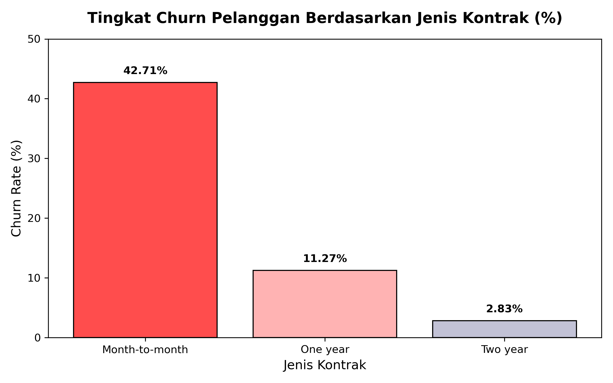
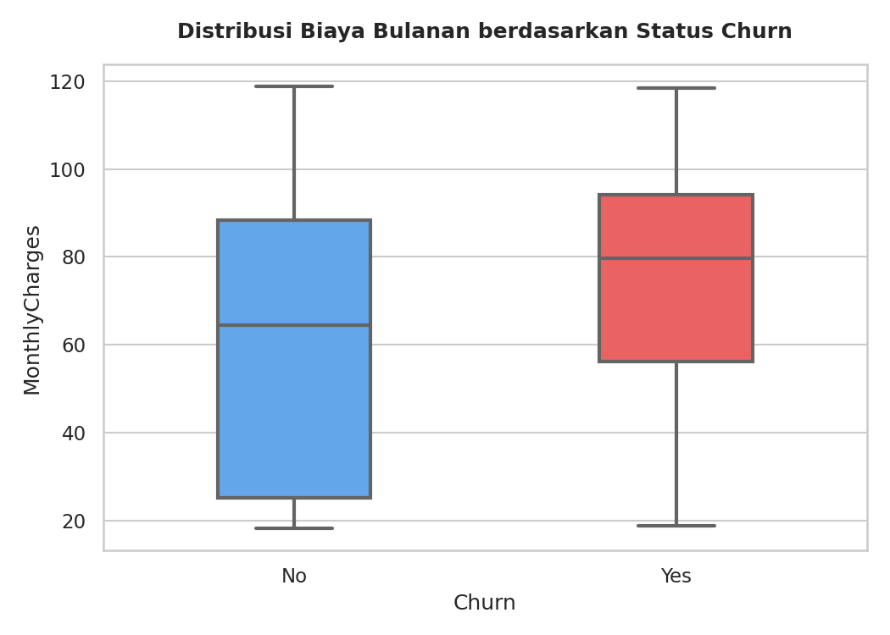
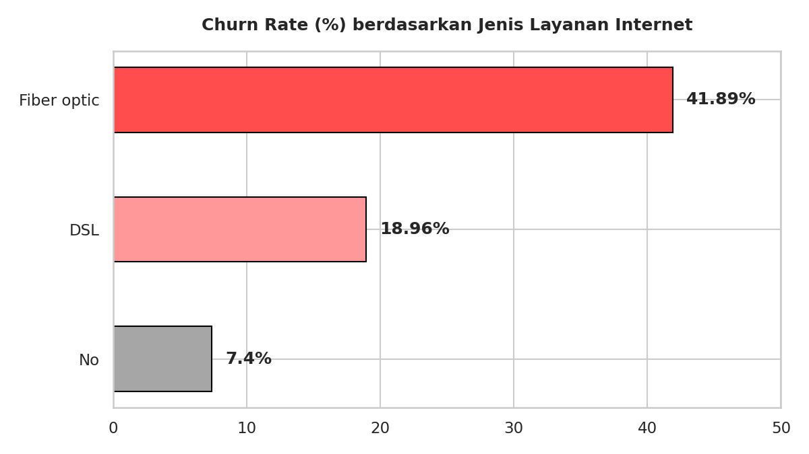
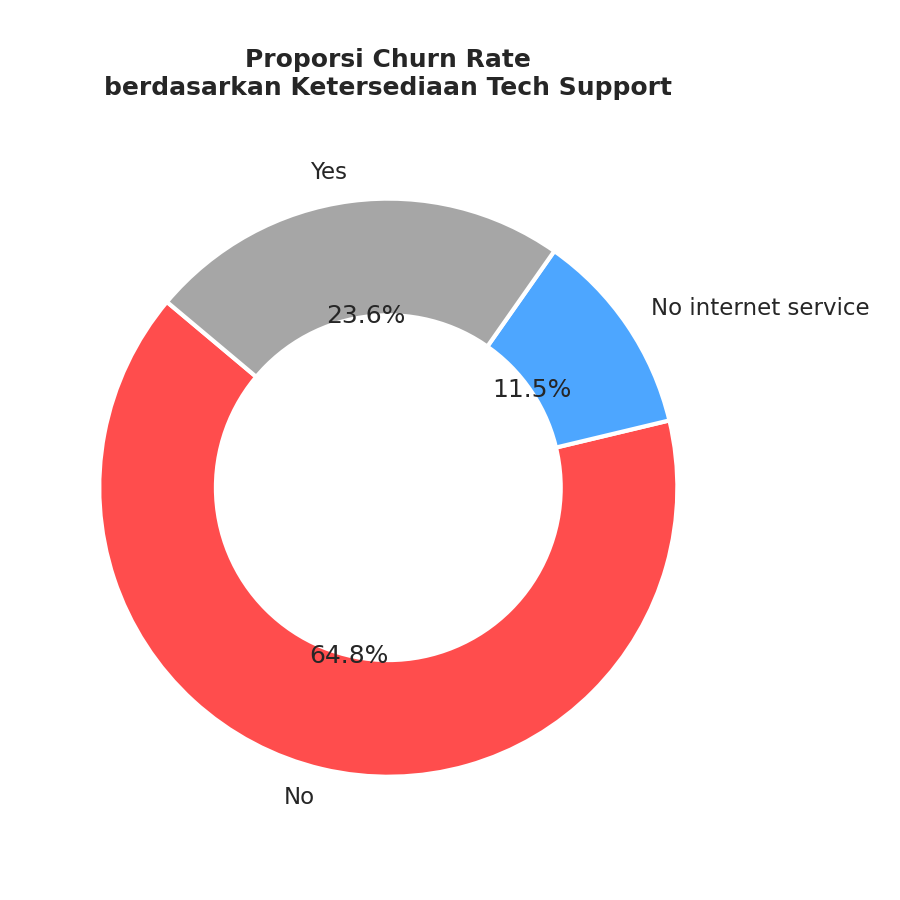
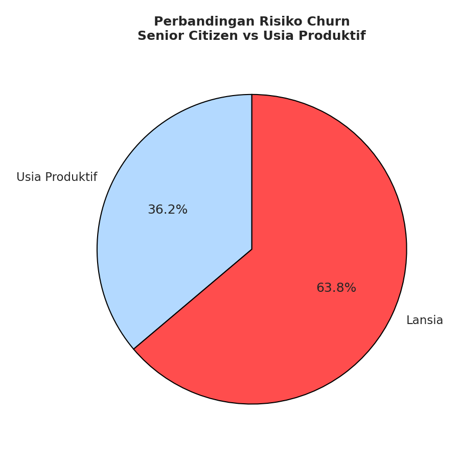
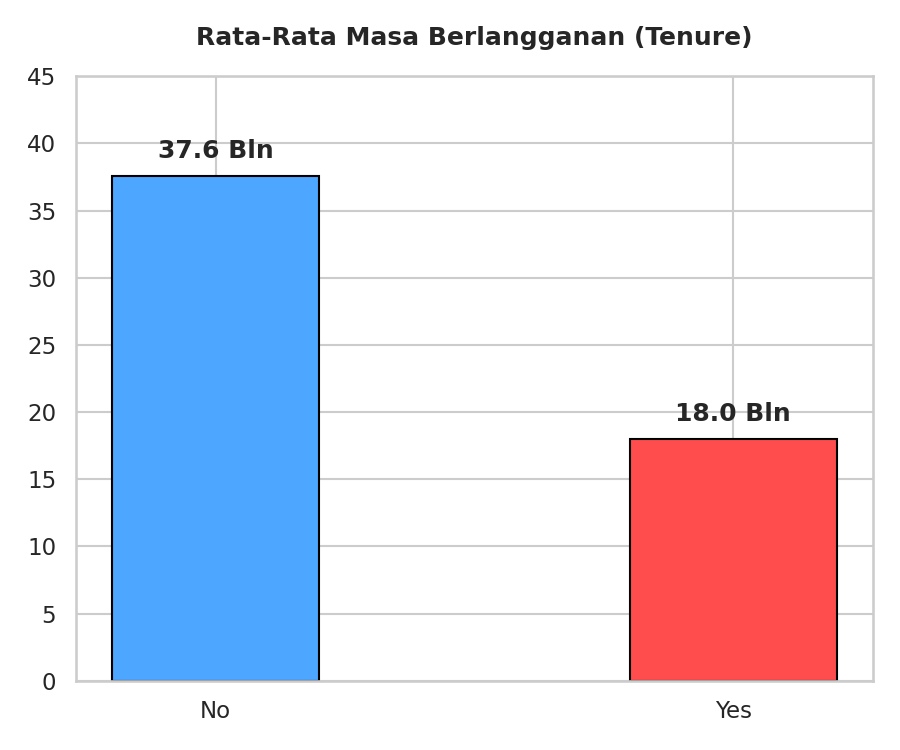

# 📞 Customer Churn Analysis: Menurunkan Angka Churn pada Sektor Telekomunikasi

## 📌 Project Overview
Proyek ini bertujuan untuk menganalisis perilaku pelanggan dan mengidentifikasi faktor risiko utama yang menyebabkan pelanggan berhenti berlangganan (*churn*) pada perusahaan telekomunikasi. Dengan menggunakan pendekatan **Data-Driven**, analisis ini memberikan rekomendasi strategis bagi tim manajemen, produk, dan CRM untuk meningkatkan retensi pelanggan (*customer retention*).

**Business Impact:** Mempertahankan pelanggan lama jauh lebih efisien secara biaya daripada mengakuisisi pelanggan baru. Analisis ini berfokus pada pencarian akar masalah mengapa 1.869 pelanggan memutuskan untuk *churn*.

---

## 🛠️ Tech Stack & Environment
* **Database Management System:** MariaDB / MySQL
* **Environment:** Linux CLI via Termux (PRoot Ubuntu Environment)
* **Dataset:** Telco Customer Churn (7,043 baris data riil)

---

## 🧼 Data Cleaning & Preprocessing
Sebelum analisis dilakukan, ditemukan isu *formatting* di mana terdapat karakter *carriage return* (`\r`) tersembunyi pada data mentah akibat perbedaan ekosistem OS (Windows ke Linux). Hal ini sempat menyebabkan kegagalan deteksi query logika `=` pada string target karena panjang karakter menjadi tidak sesuai.

Proses pembersihan dilakukan langsung di database menggunakan perintah berikut:

```
-- Menghilangkan karakter tersembunyi \r secara permanen dari kolom Churn
UPDATE telco_churn SET Churn = REPLACE(Churn, '\r', '');

-- Validasi hasil data cleaning
SELECT Churn, COUNT(*) FROM telco_churn GROUP BY Churn;

```

Hasil Validasi Akhir:

| Churn Status | Total Pelanggan |
| :--- | :---: |
| NO | 5174 |
| YES | 1869 |

## ​📊 Key Insights & Data Analysis

​1. Faktor Finansial & Komitmen Kontrak
​Analisis menunjukkan bahwa jenis ikatan kontrak dan skema biaya bulanan memiliki korelasi yang sangat kuat dengan keputusan pelanggan untuk pergi.

```
-- Mengukur Churn Rate berdasarkan Jenis Kontrak
SELECT 
    Contract,
    COUNT(*) AS Total_Pelanggan,
    SUM(CASE WHEN Churn = 'Yes' THEN 1 ELSE 0 END) AS Total_Churn,
    ROUND(SUM(CASE WHEN Churn = 'Yes' THEN 1 ELSE 0 END) * 100.0 / COUNT(*), 2) AS Churn_Rate_Persen
FROM telco_churn
GROUP BY Contract
ORDER BY Churn_Rate_Persen DESC;
```

Hasil Output:

| Contract | Total Pelanggan | Total Churn | Churn Rate (%) |
| :--- | :---: | :---: | :---: |
| Month-to-month | 3,875 | 1,655 | **42.71%** |
| One year | 1,473 | 166 | 11.27% |
| Two year | 1,695 | 48 | 2.83% |


**Visualisasi Grafik:**



Insight: Pelanggan dengan kontrak Month-to-month (Bulanan) memiliki tingkat churn yang sangat ekstrem sebesar 42.71%, sedangkan pelanggan kontrak 2 tahun hanya 2.83%. Pelanggan tanpa komitmen waktu jangka panjang terbukti sangat rapuh.
```
-- Analisis Biaya Bulanan (Monthly Charges) terhadap Churn
SELECT 
    Churn,
    ROUND(AVG(MonthlyCharges), 2) AS Rata_Rata_Biaya_Bulanan
FROM telco_churn
GROUP BY Churn;
```
Hasil Output:

| Churn Status | Rata-rata Biaya Bulanan |
| :--- | :---: |
| No | 61.27 |
| Yes | **74.44** |

**Visuaalisasi Grafik**


Insight: Rata-rata biaya bulanan pelanggan yang churn jauh lebih mahal (74.44) dibandingkan pelanggan yang bertahan (61.27). Pelanggan sangat sensitif terhadap harga yang tinggi jika tidak diimbangi dengan nilai atau kualitas layanan yang sepadan.

​2. Kualitas Produk & Layanan Pendukung

Kualitas dari infrastruktur utama dan ketersediaan bantuan teknis memegang peran vital dalam loyalitas pelanggan.
```
-- Mengukur Churn Rate berdasarkan Jenis Layanan Internet
SELECT 
    InternetService,
    COUNT(*) AS Total_Pelanggan,
    SUM(CASE WHEN Churn = 'Yes' THEN 1 ELSE 0 END) AS Total_Churn,
    ROUND(SUM(CASE WHEN Churn = 'Yes' THEN 1 ELSE 0 END) * 100.0 / COUNT(*), 2) AS Churn_Rate_Persen
FROM telco_churn
GROUP BY InternetService
ORDER BY Churn_Rate_Persen DESC;
```
Hasil Output:

| Internet Service | Total Pelanggan | Total Churn | Churn Rate (%) |
| :--- | :---: | :---: | :---: |
| Fiber optic | 3096 | 1297 | **41.89%** |
| DSL | 2421 | 459 | 18.96% |
| No | 1526 | 113 | 7.40% |

**Visualisasi Grafik**


Insight: Infrastruktur Fiber optic secara mengejutkan menyumbang angka churn sebesar 41.89%, jauh lebih tinggi daripada teknologi DSL (18.96%). Ini mengindikasikan adanya isu krusial pada stabilitas jaringan atau ketidakpuasan terhadap skema harga produk Fiber Optic.
```
-- Dampak Ketiadaan Layanan Tech Support
SELECT 
    TechSupport,
    COUNT(*) AS Total_Pelanggan,
    SUM(CASE WHEN Churn = 'Yes' THEN 1 ELSE 0 END) AS Total_Churn,
    ROUND(SUM(CASE WHEN Churn = 'Yes' THEN 1 ELSE 0 END) * 100.0 / COUNT(*), 2) AS Churn_Rate_Persen
FROM telco_churn
GROUP BY TechSupport
ORDER BY Churn_Rate_Persen DESC;
```
Hasil Output:

| Tech Support | Total Pelanggan | Total Churn | Churn Rate (%) |
| :--- | :---: | :---: | :---: |
| No | 3473 | 1446 | **41.64%** |
| Yes | 2044 | 310 | 15.17% |
| No internet service | 1526 | 113 | 7.40% |

**Visualisasi Grafik**


Insight: Pelanggan yang tidak mendapatkan atau tidak memanfaatkan bantuan teknis (TechSupport = 'No') memiliki churn rate sebesar 41.64%. Sebaliknya, kelompok yang mendapatkan TechSupport berhasil diredam angka churn-nya hingga menyisakan 15.17%.

​3. Karakteristik Demografi & Masa Berlangganan (Tenure)

​Menganalisis segmentasi usia pelanggan serta mengidentifikasi waktu paling rawan dalam siklus berlangganan.
```
-- Churn Rate berdasarkan Segmentasi Usia (Senior Citizen)
SELECT 
    CASE WHEN SeniorCitizen = 1 THEN 'Lansia (Senior)' ELSE 'Usia Produktif' END AS Kategori_Umur,
    COUNT(*) AS Total_Pelanggan,
    SUM(CASE WHEN Churn = 'Yes' THEN 1 ELSE 0 END) AS Total_Churn,
    ROUND(SUM(CASE WHEN Churn = 'Yes' THEN 1 ELSE 0 END) * 100.0 / COUNT(*), 2) AS Churn_Rate_Persen
FROM telco_churn
GROUP BY SeniorCitizen;
```
Hasil Output:

| Kategori Usia | Total Pelanggan | Total Churn | Churn Rate (%) |
| :--- | :---: | :---: | :---: |
| Usia Produktif | 5901 | 1393 | 23.61% |
| Lansia (Senior) | 1142 | 476 | **41.68%** |

**Visualisasi Grafik:**


Insight: Kelompok Lansia (Senior Citizen) jauh lebih rentan churn dengan persentase 41.68% dibandingkan usia produktif yang hanya sebesar 23.61%. Faktor adaptasi teknologi atau penyesuaian pengeluaran masa pensiun diduga menjadi pemicu utama.
```
-- Mengidentifikasi Rata-Rata Masa Bertahan (Tenure dalam Bulan)
SELECT 
    Churn,
    ROUND(AVG(tenure), 1) AS Rata_Rata_Bulan_Berlangganan
FROM telco_churn
GROUP BY Churn;
```
Hasil Output:

| Churn Status | Rata-Rata Bulan Berlangganan |
| :--- | :---: |
| No | 37.6 Bulan |
| Yes | **18 Bulan** |

**Visualisasi Grafik**


Insight: Rata-rata pelanggan yang churn memutuskan pergi pada bulan ke-18 (1.5 Tahun). Ini menandakan tahun pertama hingga pertengahan tahun kedua adalah Danger Zone (fase paling kritis) yang wajib dikawal ketat oleh tim CRM.

##Kesimpulan & Rekomendasi Strategis

​Berdasarkan seluruh temuan data di atas, kombinasi profil pelanggan dengan risiko churn paling ekstrem adalah:
​Seorang Lansia, menggunakan layanan Fiber Optic berbiaya tinggi dengan kontrak bulanan (Month-to-month), melakukan pembayaran manual via Electronic Check, tidak memiliki akses Tech Support, dan masa langganannya masih berada di bawah 18 bulan.

Actionable Recommendations:

1.Insentif Migrasi Kontrak: Mengurangi jumlah pengguna kontrak bulanan dengan menawarkan diskon khusus atau keuntungan kuota jika mereka bersedia migrasi ke kontrak minimal 1 atau 2 tahun.

​2.Auto-Debet Campaign: Memberikan potongan harga pada tagihan bulan pertama bagi pelanggan yang mengubah metode pembayaran manual (Electronic Check) menjadi otomatis (Credit Card / Bank Transfer Auto-debit).

3.Audit Kualitas Layanan Fiber Optic: Melakukan investigasi internal terkait stabilitas jaringan Fiber Optic, serta melakukan bundling wajib layanan Tech Support gratis untuk mendampingi pelanggan baru di fase Danger Zone (12 bulan pertama).

4.Program Layanan Ramah Lansia: Menyediakan jalur asistensi atau edukasi produk yang lebih mudah dipahami bagi kelompok Senior Citizen guna menekan angka kehilangan pelanggan di sektor ini.
